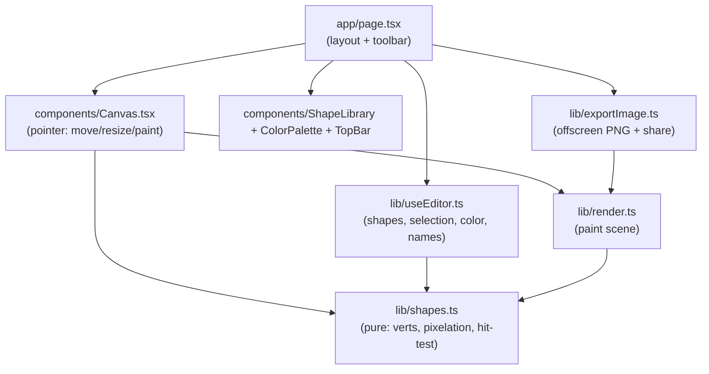

# Pixy Shapes

A kid-friendly, **Minecraft-pixelated** shape editor for iPad and Apple Pencil. Search
the shape library, tap to drop a shape on a plain white sheet, then move, resize, and
paint it - and export the finished drawing straight to Photos.


## Features

- **13 shapes, all pixelated** - square, rectangle, circle, triangle, parallelogram,
  pentagon, hexagon, octagon, star, moon (crescent), and solid / dashed / dotted lines.
  Every shape is rasterized to chunky Minecraft blocks.
- **Searchable shape library** - filter by name or keyword, tap to add to the canvas.
- **Move, resize, recolor** - drag to move, drag the corner grip to resize (everything
  snaps to the block grid). Two modes: **Move** and **Paint** (tap a shape to drop the
  active color - great with Apple Pencil).
- **Plain white sheet** - like a fresh page in Paint.
- **Name it** - a drawing name plus a silver student-name + date banner up top.
- **Export to Photos** - on iPad/iPhone the native share sheet opens with "Save Image";
  elsewhere it downloads a PNG.
- **iPad-first & responsive**, Apple-Pencil / touch / mouse via Pointer Events.

## Stack

Next.js 16 (App Router) · React 19 · TypeScript · HTML Canvas · Vitest + Playwright.
No runtime dependencies beyond React.

## Architecture

Static, client-only. All the geometry + pixelation is pure and unit-tested; the canvas
just draws the computed blocks.



- `lib/shapes.ts` - pure geometry: polygon vertices, ray-cast point-in-shape, the
  `shapeCells` rasterizer (the pixel look), hit-testing, and snap/clamp. Unit-tested.
- `lib/render.ts` - paints the scene (reused by the live canvas and the export).
- `lib/exportImage.ts` - renders a clean offscreen PNG and hands it to the Web Share API.

## Develop

```bash
npm install
npm run dev            # http://localhost:3022

npm run typecheck
npm run lint           # eslint (flat config + jsx-a11y)
npm run format:check   # prettier
npm test               # vitest unit tests
npm run test:e2e       # playwright end-to-end
```

Husky pre-push runs typecheck + lint + format + unit; GitHub Actions runs the full gate
(format, typecheck, lint, unit, build, prod audit, e2e) on every push/PR.

## License

[MIT](LICENSE)
