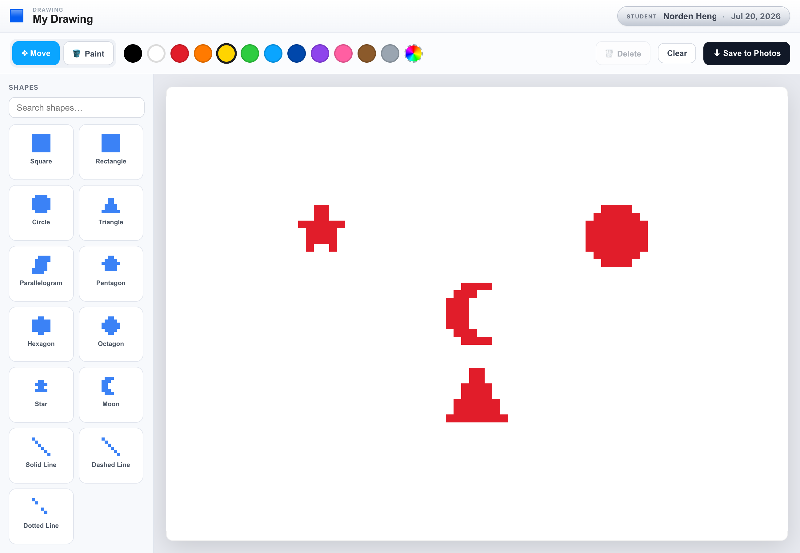
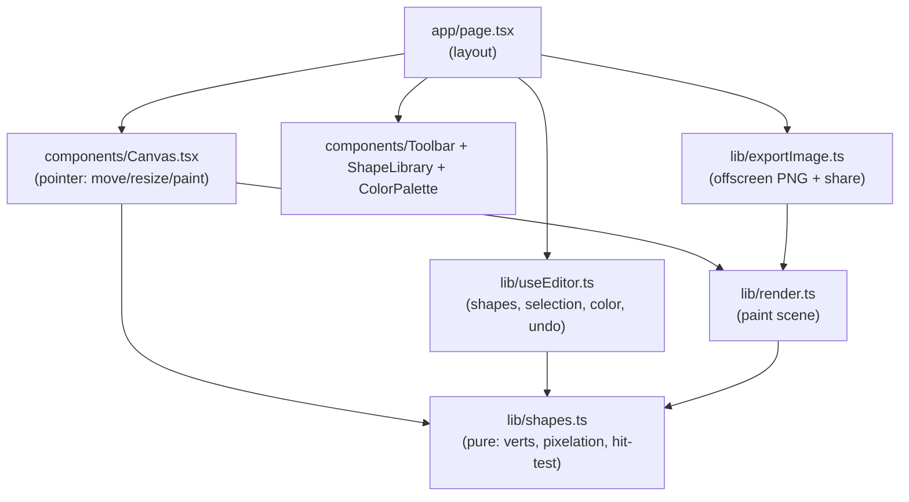

# Pixy

[](https://github.com/bunlongheng/pixy/actions/workflows/ci.yml)
[](LICENSE)
[](https://nextjs.org)
[](https://pixy-bheng.vercel.app)

A kid-friendly, **Minecraft-pixelated** shape editor for iPad and Apple Pencil. Search
the shape library, tap to drop a shape on a plain white sheet, then move, resize, and
paint it - and export the finished drawing straight to Photos.

**Live demo: [pixy-bheng.vercel.app](https://pixy-bheng.vercel.app)**



## Features

- **14 shapes, all pixelated** - square, rectangle, circle, triangle, parallelogram,
  pentagon, hexagon, octagon, star, asterisk, moon (crescent), and solid / dashed /
  dotted lines. Every shape is rasterized to chunky Minecraft blocks.
- **Tap-to-add shape grid** - a compact rail of pixelated previews; tap to drop one on the
  canvas.
- **Move, resize, rotate, recolor** - drag to move, drag a corner grip to resize, use the
  top grip to rotate (everything snaps to the block grid). **17 crayon-box colors** plus a
  custom picker.
- **Draw, fill, erase** - freehand pencil, paint-bucket flood fill of enclosed areas, and a
  cell-by-cell eraser - all great with Apple Pencil.
- **Undo + copy / paste / duplicate** - Cmd/Ctrl+Z, C, V, D; Backspace/Delete removes.
- **Plain white sheet** - a fresh full-screen page, like Paint.
- **Export to Photos** - on iPad/iPhone the native share sheet opens with "Save Image";
  elsewhere it downloads a PNG.
- **iPad-first & responsive**, Apple-Pencil / touch / mouse via Pointer Events.

## Stack

Next.js 16 (App Router) · React 19 · TypeScript · HTML Canvas · Vitest + Playwright.
No runtime dependencies beyond React. The kid-handwriting font is
[Comic Neue](https://github.com/crozynski/comicneue), bundled under the
[SIL Open Font License 1.1](public/fonts/OFL.txt).

## Architecture

Static, client-only. All the geometry + pixelation is pure and unit-tested; the canvas
just draws the computed blocks.



- `lib/shapes.ts` - pure geometry: polygon vertices, ray-cast point-in-shape, the
  `shapeCells` rasterizer (the pixel look), hit-testing, and snap/clamp. Unit-tested.
- `lib/render.ts` - paints the scene (reused by the live canvas and the export).
- `lib/exportImage.ts` - renders a clean offscreen PNG and hands it to the Web Share API.

## Develop

```bash
npm install
npm run dev            # http://localhost:3022

npm run typecheck
npm run lint           # eslint (flat config + jsx-a11y)
npm run format:check   # prettier
npm test               # vitest unit tests (coverage-gated: 95% lines/statements/functions)
npm run test:e2e       # playwright end-to-end
```

Husky pre-push runs typecheck + lint + format + unit; GitHub Actions runs the full gate
(format, typecheck, lint, unit, build, prod audit, e2e) on every push/PR.

## License

[MIT](LICENSE)

---

<p align="center">
  <sub>Built by <a href="https://bunlongheng.com">Bunlong Heng</a> &middot; <a href="https://bunlongheng.com/projects/pixy">See it in my portfolio &rarr;</a></sub>
</p>
